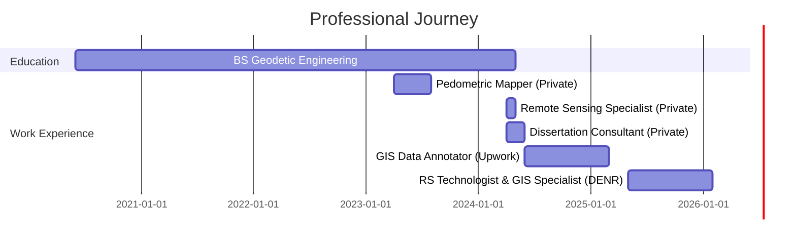

<div align="center">
  
# 👋 Hi, I'm Clemente III M. Abines

### 🛰️ Remote Sensing Technologist | 🗺️ GIS Specialist | 🤖 ML Enthusiast


<p align="center">
  <a href="mailto:clemente.abinesiii@gmail.com"></a>
  <a href="https://linkedin.com/in/your-profile"></a>
  <a href="https://github.com/chhero"></a>
</p>


</div>

---

## 🚀 About Me

<div align="center">

**Remote Sensing Technologist and GIS Specialist** with **4+ years of experience** in geospatial analysis and proficiency in GIS software. Along with around **200+ hours** of training and certifications. 

Passionate about **deep learning** and **machine learning model development**, with expertise in automating data modeling workflows integrating **Satellite and UAV imageries**.

</div>

### 🎯 What I Do

```yaml
name: Clemente III M. Abines
role: Remote Sensing Technologist & GIS Specialist
location: Tacloban City, Leyte, Philippines 🇵🇭
education: BS Geodetic Engineering
experience: 4+ years
current_work: DENR R08

expertise:
  geospatial:
    - ArcGIS Pro
    - QGIS
    - Google Earth Engine
    - Snap
    - ArcMap
    - AutoCAD
  
  remote_sensing:
    - Satellite Imagery Processing
    - UAV/Drone Operations
    - LiDAR Analysis
    - Multispectral Imaging
    - NDVI & Vegetation Indices
  
  machine_learning:
    - YOLO11 Architecture
    - Deep Learning
    - Automated Detection Models
    - Computer Vision
    - Feature Classification
  
  programming:
    - Python
    - JavaScript
    - R
    - Web Development
  
  conservation:
    - Wildlife Detection
    - Biodiversity Monitoring
    - Carbon Stock Estimation
    - Environmental Management

current_focus: "Developing AI-powered solutions for environmental conservation 🌍"
```

---

## 🛠️ Tech Stack & Tools

<div align="center">

### 💻 Languages & Frameworks


### 🗺️ GIS & Remote Sensing


### 🤖 Machine Learning & Data Science


### 🛠️ Tools & Platforms


</div>

---

## 💼 Professional Highlights

<table>
<tr>
<td width="50%">

### 🌟 Current Role
**Remote Sensing Technologist & GIS Specialist**  
*DENR R08, Tacloban City*  
*May 2025 - Present*

🔹 Developed **97.7% accuracy** wildlife detection model using YOLO11  
🔹 Led UAV mapping operations across protected areas  
🔹 Created automated carbon stock estimation algorithms  
🔹 Built web-based geospatial data management systems  
🔹 Managed drone fleet operations for Region VIII

</td>
<td width="50%">

### 🎓 Education
**Bachelor of Science in Geodetic Engineering**  
*Eastern Visayas State University*  
*2020 - 2024*

🏆 Best in Web App Development  
🏆 Best in Work Immersion  
🏆 With Honors Service Award  

**High School**  
*Sta. Fe StandAlone Senior High School*  
Computer Programming | 2014-2020

</td>
</tr>
</table>

---

## 🎯 Key Projects & Achievements

<details>
<summary><b>🦆 Automated Wildlife Detection System</b></summary>
<br>

- Developed deep learning model using **YOLO11** architecture
- Achieved **97.7% model accuracy** for Philippine Wild Duck (*Anas luzonica*) detection
- Processed UAV video flyout surveys for species inventory and population assessment
- Real-time detection and tracking capabilities for biodiversity monitoring
- Applied to wildlife conservation efforts in protected areas

**Tech Stack:** Python, YOLO11, UAV Imagery, Video Processing, Computer Vision

</details>

<details>
<summary><b>🌲 Carbon Stock & Biomass Estimation Algorithm</b></summary>
<br>

- Developed Above Ground Biomass (AGB) estimation algorithm using **Google Earth Engine**
- Integrated **Sentinel-2** imagery and vegetation indices (NDVI)
- Generated Carbon Stock maps for **Palompon Mangrove Forest Reserve**
- Achieved **3.75 Mg ha⁻¹ bias** with field-collected aboveground biomass data validation
- Automated workflow for large-scale environmental monitoring

**Tech Stack:** Google Earth Engine, ArcGIS Pro Notebooks, Python, Sentinel-2, Geospatial Analysis

</details>

<details>
<summary><b>🗺️ Multi-Hazard Risk Mapping System</b></summary>
<br>

- Created comprehensive multi-hazard maps integrating **Flood, Tsunami, Earthquake, and Storm Surge** risk indices
- Conducted spatial analysis for **Eastern Visayas State University Tanauan Campus**
- Acquired, processed, and validated satellite imagery and geospatial datasets
- Generated hazard and vulnerability indices through GIS integration
- Provided actionable insights for disaster risk reduction and management

**Tech Stack:** ArcGIS Pro, QGIS, Spatial Modeling, Satellite Imagery, Hazard Analysis

</details>

<details>
<summary><b>🌿 Urban Greenspace Detection Model</b></summary>
<br>

- Spearheaded **Random Forest Regression** model development for automated greenspace detection
- Achieved **91% model accuracy** for classification in **Tacloban City, Leyte**
- Assessment of urban greenspaces using machine learning algorithms
- Data collection and preparation for training datasets ensuring high-quality model inputs
- Contributed to urban planning and environmental sustainability research

**Tech Stack:** Python, Random Forest, Machine Learning, scikit-learn, Geospatial Data

</details>

<details>
<summary><b>🌊 Protected Area Mapping & Drone Operations</b></summary>
<br>

- Led UAV data collection and spatial analysis for **Biri-LaRosa Protected Landscape and Seascape**
- Operated **DJI Mavic 3 Multispectral and Trimble Pro VTOL** for comprehensive mapping
- Processed 50,000+ images covering the Palompon Mangrove Watershed Forest Reserve
- Conducted vegetation health assessment using **NDVI** and multispectral analysis
- Provided critical geospatial inputs for protected area management plans

**Tech Stack:** DJI Terra, Pix4DMapper, Multispectral Analysis, UAV Operations, GIS

</details>

<details>
<summary><b>✈️ Web-Based Drone Logbook System</b></summary>
<br>

- Built comprehensive **UAV operations tracking system** for DENR Region VIII
- Implemented flight records, maintenance logs, and operational data management
- Streamlined drone fleet management ensuring compliance and operational efficiency
- User-friendly interface designed for field operators with minimal technical expertise
- Enabled data-driven decision making for drone deployment strategies

**Tech Stack:** Web Development, JavaScript, PHP, MySQL, Database Management

</details>

<details>
<summary><b>📊 LiDAR Point Cloud Classification & Annotation</b></summary>
<br>

- Classified **LiDAR point clouds** following **ASPRS/ISPRS** standards
- Developed automated scripting methods to streamline classification processes
- Annotated LiDAR data for training deep learning models
- Enabled automated detection of solar cell installations using trained models
- Applied photovoltaic point cloud analysis for renewable energy applications

**Tech Stack:** LiDAR Processing, Python Scripting, Point Cloud Classification, Deep Learning

</details>

<details>
<summary><b>🗺️ Comprehensive Pedometric Mapping Project</b></summary>
<br>

- Conducted comprehensive **soil analysis** of Tacloban, San Jose, including physical and geotechnical characterization
- Measured spatial extent of each soil type using **interpolation models** for accurate variability representation
- Coordinated interpolation of geospatial datasets using **Kriging techniques**
- Generated multiple thematic maps: Atterberg Limit, Liquid/Plastic Limits, Gravity Map, Soil Moisture Map, Bearing Capacity Map, and more
- Performed Sieve Analysis for soil particle distribution (fines, gravel, sand)

**Tech Stack:** ArcGIS Pro, Geostatistics, Kriging, Spatial Analysis, Geotechnical Engineering

</details>

---

## 📊 GitHub Stats

<div align="center">
  


</div>

<div align="center">
  
[](https://git.io/streak-stats)

</div>

---

## 🏆 Core Competencies

<div align="center">

| 🛰️ Remote Sensing | 🗺️ GIS Analysis | 🤖 Machine Learning | 🚁 UAV Operations |
|-------------------|-----------------|---------------------|-------------------|
| Satellite Imagery Processing | Spatial Modeling | Deep Learning (YOLO11) | DJI Mavic 3 Multispectral |
| Sentinel-2 Analysis | Cartographic Design | Automated Classification | Trimble Pro VTOL |
| Multispectral Analysis | Database Management | Model Training & Validation | Flight Planning |
| LiDAR Processing | Web Mapping | Computer Vision | Photogrammetry |
| NDVI & Vegetation Indices | Geostatistics | Random Forest | Image Processing |
| Carbon Stock Estimation | Hazard Mapping | Feature Detection | Data Collection |

</div>

---

## 📈 Professional Experience Timeline



---

## 🌱 Currently Learning & Exploring

<table>
<tr>
<td width="50%">

### 📚 Learning Focus
- 🔭 Advanced Deep Learning architectures for environmental monitoring
- 🌐 Cloud-based geospatial computing with GEE
- 📊 Big Data analytics for climate change research
- 🚁 Advanced drone photogrammetry techniques
- 🛰️ SAR (Synthetic Aperture Radar) analysis

</td>
<td width="50%">

### 🎯 Interests
- 🌍 Environmental Conservation & Sustainability
- 🤖 AI/ML Applications in Environmental Science
- 🦜 Wildlife Monitoring & Biodiversity
- 🌲 Forest & Mangrove Conservation
- 📡 Geospatial Big Data Analytics

</td>
</tr>
</table>

---

## 🎖️ Certifications & Training

- 🎓 **200+ hours** of training and certifications in Remote Sensing and GIS
- 🛰️ Satellite Data Processing and Analysis
- 🚁 UAV/Drone Operations and Safety
- 🤖 Machine Learning and Deep Learning Applications
- 📊 Geospatial Data Science

---

## 💬 Let's Connect!

<div align="center">

### I'm always open to collaborating on projects related to:

🌍 **Environmental Conservation & Sustainability** | 🛰️ **Remote Sensing & Geospatial Analysis**  
🤖 **AI/ML Applications in Environmental Science** | 🚁 **UAV/Drone Technology**  
📊 **Data Science & Visualization** | 🌲 **Biodiversity & Wildlife Monitoring**

<br>

<table>
<tr>
<td align="center">

<br>
<b>Email</b>
<br>
<a href="mailto:clemente.abinesiii@gmail.com">clemente.abinesiii@gmail.com</a>
</td>
<td align="center">

<br>
<b>Phone</b>
<br>
+63-945-604-0910
</td>
<td align="center">

<br>
<b>Location</b>
<br>
Tacloban City, Leyte 🇵🇭
</td>
</tr>
</table>

</div>

---

<div align="center">

### 💡 *"Leveraging geospatial intelligence and cutting-edge technology to drive sustainable environmental management and biodiversity conservation for future generations."*

<br>

### 📊 My Contribution Graph

[](https://github.com/chhero)

<br>

### 🐍 Watch my contributions get eaten by a snake!


<br>

**Thanks for visiting! Have a great day! 🌟**


</div>
